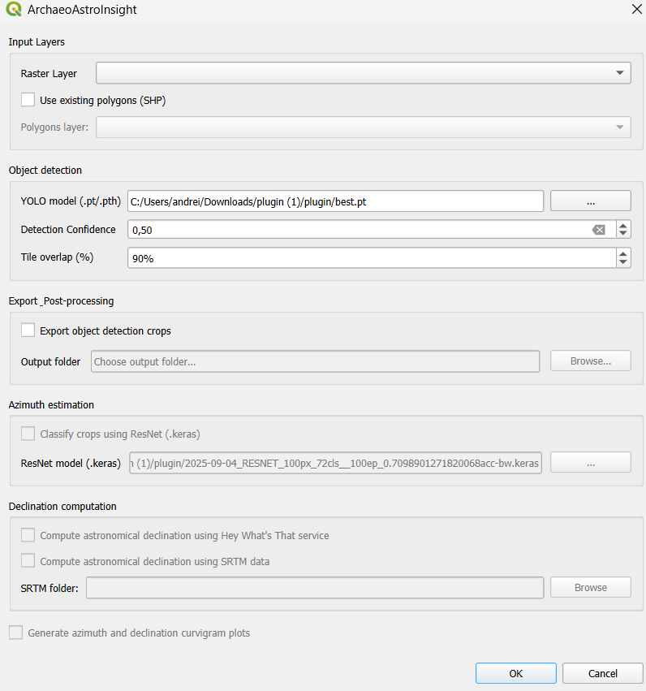

# ArchaeoAstroInsight

**A QGIS plugin for the archaeoastronomical analysis of ground-level archaeological features.**

ArchaeoAstroInsight detects features in satellite or aerial rasters using a YOLO model, estimates each feature's orientation (azimuth) with a ResNet classifier, derives the local horizon from either the HeyWhatsThat online service or local SRTM elevation data, and computes the astronomical declination of each alignment. It also generates azimuth and declination curvigrams (kernel-density plots with significance thresholds) and writes all results to a single CSV for further analysis.

---

## Features

- **Feature detection** — YOLO object detection on satellite/aerial rasters (or use existing polygon layers).
- **Azimuth estimation** — a ResNet classifier estimates the orientation of each detected feature.
- **Horizon computation** — local horizon altitude from the [HeyWhatsThat](https://www.heywhatsthat.com/) online service and/or local **SRTM** elevation tiles.
- **Declination** — astronomical declination for each feature/horizon combination.
- **Curvigrams** — azimuth and declination kernel-density plots with significance thresholds.
- **Consolidated output** — everything lands in a single `Results/results.csv`, plus curvigram PNGs.

---

## Requirements

- **Windows 10 / 11 (64-bit)**
- **QGIS 3.34 or newer** — these ship Python 3.12, which the plugin requires. The install scripts auto-detect QGIS under `C:\Program Files\QGIS ...` or `C:\OSGeo4W`.
- **Administrator rights** — the Python dependencies are installed into QGIS's own Python.
- **Internet connection** — needed the first time, to download the dependency wheels (see installation).

### External Python dependencies

This plugin depends on heavy third-party Python packages that are **not bundled** with it and are **not** stored in this repository:

> numpy, scipy, matplotlib, pandas, scikit-learn, opencv-python-headless, Pillow, requests, tqdm, PyYAML, psutil, **torch** (CPU), **torchvision**, **tensorflow**, **ultralytics**, and **astrocult** (+ multipledispatch, skyfield, jplephem, sgp4) for the archaeoastronomy library.

They are installed into QGIS's Python by the included scripts, using pinned versions (see `requirements.lock`), so they do not disturb the libraries QGIS ships.

### Nothing else to install — data you provide

Apart from a supported QGIS and the two install scripts, **no other software is required**: there is no separate Python, no C/C++ compiler, and no GPU/CUDA requirement (PyTorch and TensorFlow run on the CPU). You do, however, supply your own **data**:

- a **YOLO** detection model (`.pt`/`.pth`) and a **ResNet** azimuth model (`.keras`), chosen in the dialog;
- **SRTM elevation tiles** (a folder of `.hgt` / `.tif` / … rasters) — only if you use the SRTM horizon option. The HeyWhatsThat option needs no local data, just an internet connection.

---

## Installation

However you install it, the plugin folder must be named exactly **`ArchaeoAstroInsight`**, and you must run two short scripts **as Administrator** to install its Python dependencies into QGIS's own Python (QGIS itself does not install them). Pick the route that matches how you obtained the plugin.

### Option A — From the QGIS Plugin Repository

Installing through **QGIS → Plugins → Manage and Install Plugins** places the plugin — these `.bat` scripts included — inside your QGIS profile, but QGIS does **not** install the heavy Python dependencies, so the plugin will not run until you do:

1. In QGIS, go to **Settings → User Profiles → Open Active Profile Folder**, then open `python\plugins\ArchaeoAstroInsight`. (Full path: `%APPDATA%\QGIS\QGIS3\profiles\default\python\plugins\ArchaeoAstroInsight`.)
2. Right-click **`01_build_wheels_admin.bat`** → **Run as administrator** (downloads the dependency wheels; needs internet).
3. Right-click **`02_install_global_admin.bat`** → **Run as administrator** (installs the dependencies; it detects that the plugin is already in your profile and skips the copy step).
4. Restart QGIS, then tick **ArchaeoAstroInsight** under **Plugins → Manage and Install Plugins → Installed**.

### Option B — Manual install (from GitHub or a downloaded copy)

Use this route if you cloned or downloaded this repository rather than installing from the QGIS Plugin Repository. Run the scripts from the plugin folder you downloaded.

#### Step 1 — Download the dependency wheels (one-time, requires internet)

The wheels are intentionally **not** committed to this repository (they are several hundred MB). Build them locally:

1. Connect to the internet.
2. Right-click **`01_build_wheels_admin.bat`** → **Run as administrator**.
   This downloads every dependency wheel (including transitive dependencies) into a local `wheels\` folder.

#### Step 2 — Install dependencies and deploy the plugin

1. Close QGIS.
2. Right-click **`02_install_global_admin.bat`** → **Run as administrator**. This will:
   - install every Python dependency into QGIS's Python (offline, from `wheels\`);
   - copy the plugin into your QGIS profile at
     `%APPDATA%\QGIS\QGIS3\profiles\default\python\plugins\ArchaeoAstroInsight`;
   - remove any older copy automatically.

#### Step 3 — (Optional) Verify the dependencies

Right-click **`03_verify.bat`** → **Run as administrator**. It prints the versions of NumPy, OpenCV, Torch, TensorFlow, Ultralytics, etc. and ends with `[OK] All dependencies import correctly.`

#### Step 4 — Enable the plugin

Start QGIS → **Plugins → Manage and Install Plugins → Installed**, and tick **ArchaeoAstroInsight**.

> **Troubleshooting — "QGIS Python 3.12 not found":** edit the `QPY` line near the top of the `.bat` to point at your QGIS `python.exe`, e.g.
> `set "QPY=C:\Program Files\QGIS 3.40.10\apps\Python312\python.exe"`
>
> `03_verify.bat` and this troubleshooting note apply to **Option A** as well.

---

## Usage

Open the plugin from the **Plugins** menu (or its toolbar icon). The dialog is one scrollable panel of grouped options that run top-to-bottom as a single pipeline: detect features → export crops → classify orientation → compute declination → plot curvigrams.

> **The one thing to know first:** everything below *Object detection* is gated behind **Export object detection crops**. Until you tick that box **and** choose an output folder, the ResNet, declination, and curvigram options stay greyed out — this is intentional, not a bug. Tick it first and the rest of the dialog comes alive.

### Quick start (a full run)

1. **Input Layers** → pick your **Raster Layer**.
2. **Object detection** → browse to a **YOLO model** (`.pt`/`.pth`); leave Confidence and Tile overlap at their defaults to start.
3. **Export & Post-processing** → tick **Export object detection crops** and choose an **Output folder**. *(This unlocks the sections below.)*
4. **Azimuth estimation** → tick **Classify crops using ResNet** and browse to your **ResNet model** (`.keras`).
5. **Declination computation** → tick **Hey What's That service** and/or **SRTM data** (for SRTM, also pick the tiles folder).
6. Optionally tick **Generate … curvigram plots**.
7. Click **OK**. Results land in `<output folder>\Results\` (see [Output](#output)).

### The dialog, section by section

*The dialog on first open. Notice that the **Azimuth estimation**, **Declination computation**, and **curvigram** sections are greyed out — they stay disabled until you tick **Export object detection crops** and choose an output folder.*

**1. Input Layers**
- **Raster Layer** — the satellite/aerial image to analyse.
- **Use existing polygons (SHP)** — tick to *skip* YOLO detection and use features you already have. This **hides the Object detection group** and enables the polygon picker below (it's an either/or choice).
- **Polygons layer** — the polygon layer to use (only when the box above is ticked).

**2. Object detection** *(hidden when you're in polygon mode)*
- **YOLO model (.pt/.pth)** — your detection model, chosen via **…**. Remembered between sessions.
- **Detection Confidence** — minimum score (0–1, default **0.50**) for a detection to be kept; higher = fewer, more confident detections.
- **Tile overlap (%)** — the raster is processed in tiles; this is how much neighbouring tiles overlap (0–99%, default **25%**) so features on tile edges aren't cut off.

**3. Export & Post-processing**
- **Export object detection crops** — **the master switch.** Saves a PNG crop of each detected feature *and* unlocks the ResNet / declination / curvigram stages. Leave it off for a detection-only run.
- **Output folder** — where crops and the `Results/` folder are written (enabled once the box above is ticked).

**4. Azimuth estimation**
- **Classify crops using ResNet (.keras)** — estimate each feature's orientation (azimuth) with a ResNet classifier. Available only when *Export crops* is on.
- **ResNet model (.keras)** — your classifier, chosen via **…**. Remembered between sessions.

**5. Declination computation** *(available once the ResNet stage will run)*
- **Hey What's That service** — derive the local horizon from the online [HeyWhatsThat](https://www.heywhatsthat.com/) service (needs internet, no local data).
- **SRTM data** — derive the horizon from your own local SRTM elevation tiles instead (works offline).
- **SRTM folder** — the folder of SRTM tiles (enabled when *SRTM data* is ticked). You may tick **both** horizon methods to compute and compare each.

**6. Generate azimuth and declination curvigram plots**
- Produces the kernel-density curvigram PNGs (available once the ResNet stage will run). Which declination curvigrams appear depends on whether you ticked HWT and/or SRTM above.

**OK / Cancel** — **OK** runs the pipeline; **Cancel** closes the dialog without running.

> **Models are not bundled:** you supply your own YOLO (`.pt`/`.pth`) and ResNet (`.keras`) models via the dialog.

### Output

Everything is written under `<output folder>\Results\`:

- `results.csv` — filename, ResNet azimuth, horizon (HWT/SRTM), declination (HWT/SRTM), observer lat/lon.
- `curvigram_resnet.png` — ResNet azimuth curvigram.
- `curvigram_declination_hwt.png` / `curvigram_declination_srtm.png` — declination curvigrams (for whichever horizon methods were selected).
- `resnet_predictions.csv` — per-crop ResNet predictions.

---

## Authors

Andrei Ancuta, Helga Hochbauer, Maitane Urrutia, Marc Frincu
West University of Timișoara (UVT)

Contact: andrei.ancuta@e-uvt.ro

## License

Released under the **GNU General Public License v2.0** — see [`LICENSE`](LICENSE).
